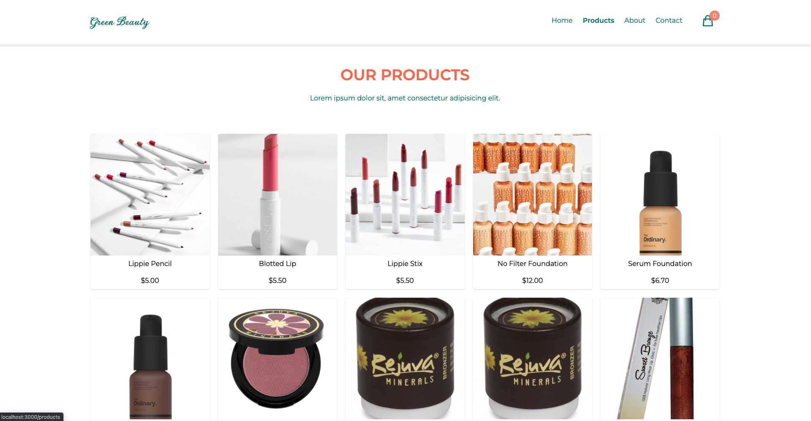
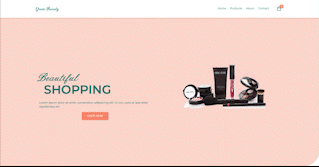

# E-commerce App

It a responsive Vegan Cosmetics Ecommerce Store.

## How does it look like?

## How to use

Go to [this page](https://j45t7.github.io/makeup-store/)!

## Tech Stack

- React JS with Typescript
- Tailwind Styled Component
- Redux Toolkit
- React Router

### Features

- This application utilizes [Makeup API](https://makeup-api.herokuapp.com/).

## How to run locally

clone the repo,
`npm install` then `npm start`,
then listen to `localhost:3000`

## Status

❌ not finished yet
